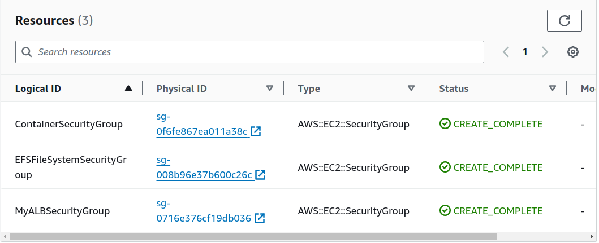

# AWS CloudFormation Infrastructure Setup with EFS, ECS and ALB

___Objective:___
Create a simple AWS infrastructure (CloudFormation) to deploy a basic web application. Utilize Amazon EFS to store the HTML page content and Amazon ECS for containerized deployment.

__Requirements:__

___Amazon EFS:___
    • Create an Amazon EFS file system named "tm-devops-trainee-efs."
    • Ensure that the EFS file system is mounted on the ECS instances to store the HTML content.
    • Use appropriate security settings for the EFS.
___Amazon ECS:___
    • Define an ECS task definition that runs a Docker container.
    • Use a public Docker image of Nginx web server.
    • Mount the EFS file system to the container to serve the HTML content.
    • Configure the ECS service to run 1 task.
___ALB:___
    • Create an ALB named "tm-devops-trainee-alb."
    • Configure the ALB listener on port 80 to forward traffic to the ECS service.
    • Implement health checks on the ALB to ensure the ECS service's availability.
___Security Group:___
    • Create security groups for both the ECS instances and the ALB.
    • Allow incoming traffic on port 80 to the ECS instances from the ALB.
    • Configure appropriate security settings for the ALB.
___Web Application:___
    • Create a simple HTML page with the content: "Hello, Techmagic!"
    • Upload this HTML page to the EFS file system.

__1. Create VPC template__
Before creating an EFS template, you need to create a VPC template with two subnets and other necessary resources. For the Application Load Balancer to work correctly, two public subnets PublicSubnet1 and PublicSubnet2 are required. To make our container inaccessible from the Internet, we need to create two private subnets PrivateSubnet1 and PrivateSubnet2. You also need to create the necessary Route Tables and other services. Such as: InternetGateway, NatGatewayOne and NatGatewayTwo. In order to be able to use the values in other templates we need export it. 


__2. Create security groups template__ 
The next step is to create a security group for our Application Load Balancer, in which we will specify the rules for accessing the load balancer from the Internet. Also at this step, we will create a security group for our container so that the Application Load Balancer can communicate with it, and also create a security group for EFS so that it can communicate with the container. 


__3. Create Amazon EFS__
In this step, we create the EFS as well as EFSMountTargetOne and EFSMountTargetTwo in order to connect the EFS to the ECS in the future.


__4. Create IAM Roles__
We create IAM roles to allow EFS to be mounted to ECS in the following template.


__5. Create Load Balancer__
In this step, we create a Load Balancer, Load Balancer Listener - a resource that defines an HTTP listener on port 80 for ALB and configures it to automatically forward all received requests to the specified ALBTargetGroup. Target Group defines a set of instances that process traffic and sets rules for routing this traffic to these instances, providing load balancing and health management for the target instances.


__6. Create ECS__
In this step, we create a cluster in the ECS. After that, we create a TaskDefinition that defines the configuration of the ECS task in which the Nginx container is deployed in the Fargate environment with network parameters, mount points for Amazon EFS, logging settings, and other characteristics such as resource amounts and the use of EFS to store container data. Lastly, we create a Service for the TaskDefinition. This Service creates and manages the running container instances based on the specified parameters such as service name, cluster, startup configuration, number of desired instances, network settings, and others, and connects it to the network and the target group to interact with the Load Balancer.


__7. Web Application__
First need open CloudShell session in running container using a command like this:
```
aws ecs execute-command \
  --cluster tm-devops-trainee-cluster \
  --task <insert task ID here> \
  --container nginx \
  --interactive \
  --command "/bin/sh"
```
Then type next command:
```
cd /usr/share/nginx/html
```
and create an index.html with the required content:
```
echo "<!DOCTYPE html><html><head><title>Hello, Techmagic!</title></head><body><h1>Hello, Techmagic!</h1></body></html>" > index.html
```
Now, when we go to the Loadbalancer url, we will see the following inscription: Hello, Techmagic!

Going to CloudFormation, we see that the entire infrastructure has been created successfully!
